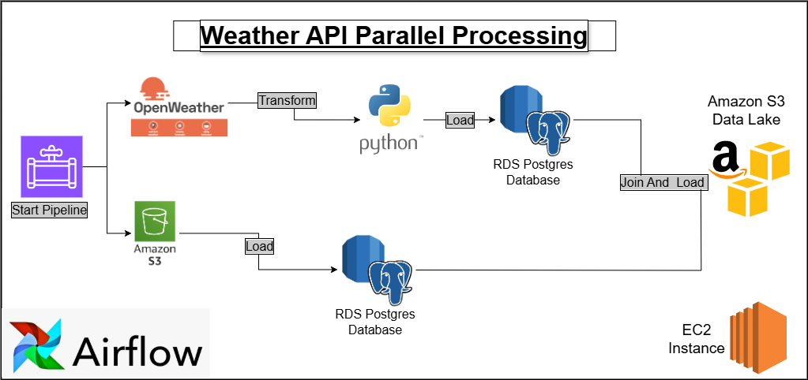

# Weather and S3 Data Integration Pipeline with Apache Airflow on AWS

This project demonstrates an ETL pipeline built with **Apache Airflow** on an **AWS EC2 instance**. The pipeline pulls data from the **OpenWeather API** and **Amazon S3**, performs transformations, loads the data into an **RDS PostgreSQL database**, joins the datasets, and exports the results to **Amazon S3**.

## Architecture Diagram

## Project Overview
The pipeline integrates two data sources:
1. **OpenWeather API** for real-time weather data.
2. **Amazon S3** for additional data files.

Both sources are processed in parallel to optimize runtime and loaded into **RDS PostgreSQL** for storage and joining. The final joined data is exported to an **S3 bucket** for storage and future analysis.

### Key Components
- **EC2 Instance**: Hosts Apache Airflow.
- **Apache Airflow**: Orchestrates the ETL workflow.
- **Python (Pandas)**: Performs data transformation.
- **RDS PostgreSQL**: Stores and processes data.
- **Amazon S3**: Stores raw and final data outputs.

## Pipeline Steps
1. **Initialize EC2 Instance and Apache Airflow**: Spin up an EC2 instance and set up Apache Airflow.
2. **Ingest Weather Data**: Use the OpenWeather API to fetch weather data.
3. **Load Data from S3**: Retrieve additional data from an Amazon S3 bucket.
4. **Transform Data**: Use Python and Pandas to clean and prepare the weather data.
5. **Load Data to RDS PostgreSQL**: Load both the weather data and S3 data into RDS PostgreSQL in parallel.
6. **Inner Join in PostgreSQL**: Join the datasets based on a common key.
7. **Store Joined Data in S3**: Export the final joined data to S3 for further analysis.

## Technologies Used
- **AWS EC2** for hosting Airflow.
- **Apache Airflow** for workflow orchestration.
- **OpenWeather API** for data ingestion.
- **PostgreSQL** on AWS RDS for database storage and processing.
- **Amazon S3** for data storage.
- **Python (Pandas)** for data transformation.
